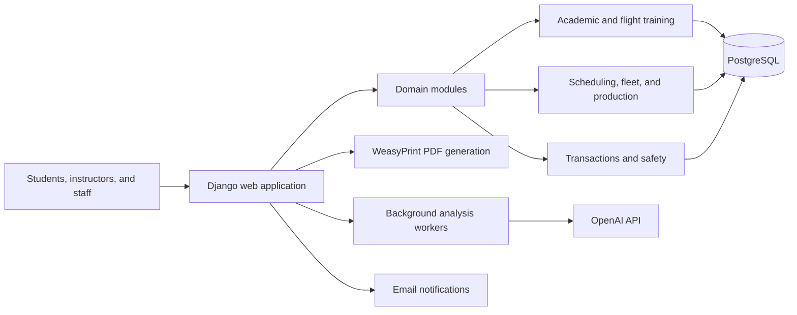

# NAV Aviation

NAV Aviation is a production web platform built for a flight training organization. It brings academic records, flight operations, scheduling, fleet information, student finances, and safety management into a single role-based system.

I designed, developed, deployed, and currently maintain the platform as its sole developer. The application was created for one school's operational requirements and is presented here as an engineering portfolio project—not as a general-purpose product or an open-source package.

[Visit the public website](https://www.navaviation.org/)

## The problem

Running a flight school requires information to move reliably between students, instructors, and administrative staff. Training progress, aircraft availability, evaluations, schedules, payments, and safety actions are closely related, but are often handled through disconnected tools and manual processes.

NAV Aviation provides one source of truth for those workflows while giving each user access only to the information and actions relevant to their role.

## What the platform covers

- **Flight training:** Flight and simulator session records, structured evaluations for different training phases, instructor assignments, student flight logs, and downloadable PDF reports.
- **Academic management:** Course editions, subjects, grading components, instructor grade submission, and student progress tracking.
- **Scheduling:** Flight periods, reservable slots, requests, approvals, resource coordination, and cancellation-fee tracking.
- **Fleet and maintenance:** Aircraft and simulator records, availability, operating hours, utilization information, and discrepancy reporting.
- **Student finances:** Categorized transactions, approval workflows, balances, rate snapshots, and audit-friendly transaction histories.
- **Safety management:** Voluntary hazard reports, risk evaluations, mitigation actions, supporting evidence, follow-up dates, and resolution tracking.
- **Operational reporting:** Role-specific dashboards, production and fuel reporting, and document generation for operational records.

## Selected engineering highlights

### Domain-specific workflows

The system models the relationships between academic training, flight sessions, instructors, aircraft, student accounts, and safety processes. Business rules are implemented around real operational workflows rather than generic CRUD screens—for example, staged flight evaluations, approval-based transactions, scheduling states, and risks mitigation follow-up.

### Role-based access

NAV Aviation uses a custom Django user model with separate student, instructor, and staff profiles. Authentication, permissions, and role-specific views restrict access to sensitive academic, financial, operational, and safety information.

### AI-assisted analysis

The AURA and SARA subsystems use the OpenAI Responses API to assist with training reviews and safety-risk analysis. Processing is handled through dedicated service logic and background workers, with validation and human-facing workflows around generated results. AI output supports staff decision-making; it does not replace operational oversight.

### Reporting and traceability

The platform produces styled PDF records with WeasyPrint and preserves important operational context such as approval state, applied rates, evaluation history, mitigation evidence, and responsible users.

### Long-term ownership

Beyond initial development, I am responsible for requirements discovery, architecture, database design, backend and frontend implementation, deployment, production maintenance, feature development, and test upkeep. The project has evolved continuously as the school's processes have matured.

## Architecture

The application follows Django's server-rendered architecture, with domain-focused apps sharing a central authentication and permissions model. PostgreSQL is used in production, while SQLite supports local development.

## Technology

- Python and Django 5.2
- PostgreSQL in production and SQLite for local development
- Django templates, HTML, CSS, and JavaScript
- WeasyPrint for PDF generation
- OpenAI Responses API for assisted analysis
- SMTP email notifications
- Django's test framework and Factory Boy

## Screenshots

Sanitized screenshots of the main role-based workflows will be added here. All portfolio media uses demonstration data and excludes student, staff, financial, and operationally sensitive information.

Suggested views include:

- Role-based launchpad or dashboard
- Flight evaluation and student progress views
- Scheduling workflow
- Safety report and mitigation workflow
- Production or operational reporting
- Example generated PDF with synthetic data

## Quality and data protection

- Automated tests cover core models, forms, views, permissions, workflows, reports, and background-processing behavior.
- Secrets and environment-specific configuration are kept outside version control.
- Runtime databases, logs, user uploads, and generated artifacts are excluded from the repository.
- Public screenshots and examples use synthetic or anonymized data.

## Project scope

This repository documents a custom, actively maintained production system developed for a single organization. It is not intended for third-party installation, redistribution, or external contributions, so public deployment instructions and contribution guidelines are intentionally omitted.

The source code is provided for portfolio review. All rights are reserved unless stated otherwise.

## Contact

For professional inquiries:

- **Email:** [luisrnandezc@gmail.com](mailto:luisrnandezc@gmail.com)
- **Website:** [navaviation.org](https://www.navaviation.org/)
